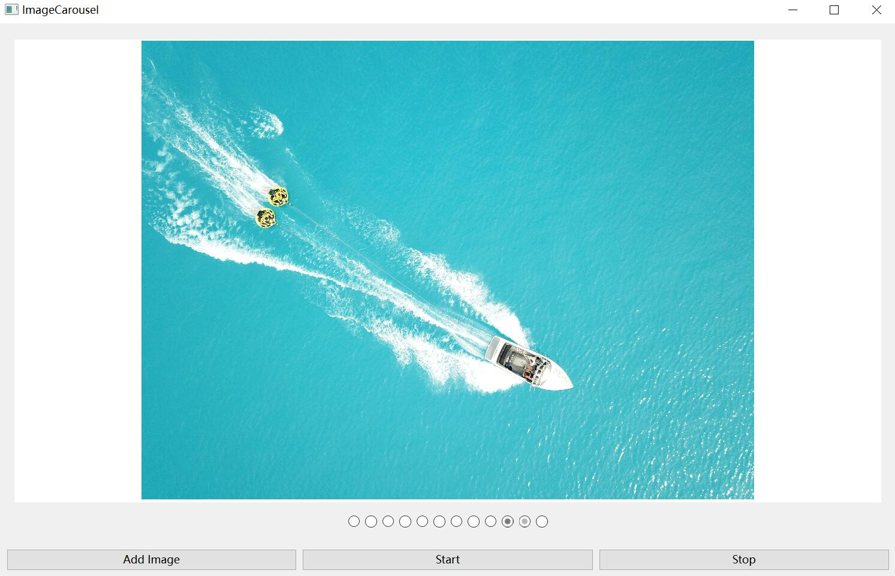

# Some simple common examples of Qt

-   [Simplified Chinese](README.md)
-   [English](README.en.md)

## [QT practical tips (updated as soon as they come to mind) | Free will (realchuan.github.io)](https://realchuan.github.io/2021/10/12/QT%E5%AE%9E%E7%94%A8%E5%B0%8F%E6%8A%80%E5%B7%A7%EF%BC%88%E6%83%B3%E5%88%B0%E5%B0%B1%E6%9B%B4%E6%96%B0%EF%BC%89/)

## [Battery](Battery/)--Battery;

<table>
    <tr>
        <td >

</td >
        <td >

</td>
    </tr>
</table>

## [Bootstrap](Bootstarp/)--Auto-start settings and detection when the program is powered on;

1.  Read and write the registry under Windows (HKEY_CURRENT_USER\\SOFTWARE\\Microsoft\\Windows\\CurrentVersion\\Run) to achieve automatic startup at boot;
2.  Copy the plist file to ~/Library/LaunchAgents/ under MacOS, and use the launchctl load/unload command to achieve automatic startup at boot;
3.  Copy the .service and .timer files to ~/.config/systemd/user/ under Ubuntu, and use the systemctl --user enable/disable command to implement automatic startup at boot;
    1.  The systemctl command is used in the .timer file, which is used to execute the .service file regularly to prevent the qxcbconnection: could not connect to display error from occurring after the graphical interface is started;
    2.  There is no need for a regularly executed .service file. You can directly use the systemctl --user enable/disable command to implement automatic startup at boot;
    3.  You can also copy the .desktop file under /usr/share/Application/ to ~/.config/autostart/ to achieve automatic startup at boot (not verified);

## [BubbleWindow](BubbleWindow/)——Bubble dialog box, which can also be used as a tool tip (ToolTip);

## [Chart](Chart/)——Visual chart drawing, reference[Use QChart to display real-time dynamic curves](https://qtdebug.com/qtbook-paint-realtime-curve-qchart/ "qtdebug/公孙二狗")Examples related to QChart;

图一二是动态曲线
  

图一二是动态曲线， 图二坐标轴也会动态变化

## [CheckBoxStandardItem](/CheckBoxStandardItem)——StandardItem that can be checked, and the parent node status or child node status is automatically updated according to the checked status;

## [Clock](/Clock)--clock;

## [DashBoard](/DashBoard)--dash board;

## [FlowLayout](FlowLayout/)——Flow layout, from QT example Flow Layout Example;

## [DragDrop](DragDrop/)——Simple control drag and drop, refer to the QT example Drag and Drop Puzzle Example;

## [HttpClient](/HttpClient)——http client;

## [ImageCarousel](ImageCarousel/)——Simple picture carousel;

## [GridViewModel](/GridViewModel)——Adaptive palace chart based on QListView;

## [LogAsynchronous](LogAsynchronous/)——Asynchronous logging, create a thread to write logs to files, and separate the front and back ends.

1.  Log file name: application name (appname). time (time, accurate to seconds). host name. process ID (Tid). log (. count). If a single log written in a day is close to 1G, a suffix will be added automatically. (.1,.2.3..., and so on) Create a new log file to write, and rollFile will still be rolled at 0 o'clock every day;
    1.  Normal file name: LogAsynchronous.2020-04-26-20-29-03.Youth.11828.log;
    2.  The log written on that day was close to 1G, and the new file name was: LogAsynchronous.2020-04-26-20-38-55.Youth.11828.log.1;
2.  日志格式：时间（time，精确到毫秒）.线程ID（Pid）.日志级别（debug）.打印信息（msg）.文件（File）.行号（Line）。
    1.  For example: 2020-04-26 20:38:55.818 2052[Debug]123456789qwertyuioplkjhgfdsa 8412789-File:(..\\logAsynchronous\\main.cpp) Line:(19)；

## [MulClient](MulClient/)——Multi-threaded client, one client per thread (how to bypass system limitations and simulate millions of clients);

## [MulServer](MulServer/)——Multi-threaded server, one thread and one client processing (processing TCP communication with high real-time performance);

## [Navigation Progress Bar](/NavigationProgressBar)——Navigation progress bar;

## [PasswordLineEdit](PasswordLineEdit/)——Password input box;

<table>
    <tr>
        <td >

</td >
        <td >

</td>
    </tr>
</table>

## [ProgressArc](ProgressArc/)——Arc progress bar;

## [ProgressBar](ProgressBar)——QProgressBar rounded corner alternative;

## [ReactorServer](ReactorServer/)——Multi-threaded server, Reactor mode (Echo);

## [SimpleUdp](SimpleUdp/)——Simple UDP example, broadcast and receive;

## [ShowInMyComputer](ShowInMyComputer/)——Show current applications in My Computer;

Firewall whitelist.

## [SlipButton](SlipButton/)——Sliding button;

Another: A simpler implementation:[Animated CheckBox](http://qtdebug.com/qtbook-animated-checkbox/)；

<table>
      <tr>
          <td >

</td >
          <td >

</td>
      </tr>
  </table>

## [SqlTabview](SqlTabview/)——SQLite database call, model method;

## [TableViewModel](TableViewModel/)——Table view;

1.  Various custom agents
    1.  [ButtonDelegate](./TableViewModel/buttondelegate.h)；
    2.  [ComboBoxDelegate](./TableViewModel/comboboxdelegate.h)；
    3.  [ProgressBarDelegate](./TableViewModel/progressbardelegate.h)；
    4.  [RichTextItemDelegate](./TableViewModel/richtextitemdelegate.hpp)；
    5.  [StarDelegate](./TableViewModel/stardelegate.h)----From Qt example Star Delegate Example;
2.  One hundred thousand level data rendering;

## [Thread](Thread/)——Multi-threading examples, 6 ways of writing;

## [TreeViewModel](TreeViewModel/)——Tree view (MVC), QtCreator source code;

  

## [Validator](Validator/)——Enhanced versions of IntValidator (QIntValidator) and DoubleValidator (QDoubleValidator)

## [packaging](packaging/)——Packaging script;

1.  [macos](packaging/macos/)——macos qmake compiles and packages dmg package script (`python`/`appdmg`）；
2.  [ubuntu](packaging/ubuntu/)——Ubuntu qmake compiles and packages AppImage/deb package script (`linuxdeployqt-continuous-x86_64.AppImage`/`dpkg-deb`）；
3.  [windows](packaging/windows/)——windows qmake compilation, packaging and installation script (`Innosetup`）；

    1.  `Innosetup``signtool`

            sha256="C:\\Program Files (x86)\\Windows Kits\\10\\bin\\10.0.18362.0\\x86\\signtool.exe" sign /f C:\\certificate\\certificate.pfx /p password /fd SHA256 /tr http://timestamp.digicert.com/scripts/timestamp.dll /td SHA256 $f
